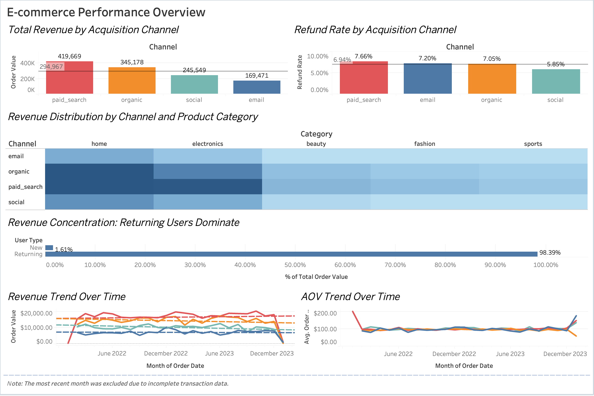

# ecommerce-data-analytics-portfolio

**End-to-end data analytics project analysing transactional e-commerce data to uncover user behaviour, revenue trends, and acquisition channel performance using Python and SQL-based analytical thinking.**

---

## Background

This project analyses historical transactional and user-level data from a mid-sized Australia-based e-commerce platform operating across multiple product categories, including **Electronics, Home, Fashion, Beauty, and Sports**.

The platform serves customers across **AU, US, UK, and CA**, and acquires traffic through a mix of **organic, paid search, social media, and email channels**.

The analysis simulates a real-world commercial analytics workflow, from raw data quality assessment to actionable business insights.

---

## Data Overview

The dataset consists of four core tables commonly used in e-commerce analytics:

### users
Customer profile and signup information  
- **Primary key:** `user_id`

### products
Product catalogue and pricing data  
- **Primary key:** `product_id`

### orders
Order-level transaction data including channel and payment information  
- **Primary key:** `order_id`  
- **Foreign key:** `user_id` → `users.user_id`

### order_items
Line-item level purchase details (product-level granularity)  
- **Foreign key:** `order_id` → `orders.order_id`  
- **Foreign key:** `product_id` → `products.product_id`

---

## Data Quality Notes

As with most production datasets, multiple data quality issues were identified during initial exploration, including:

- Missing customer and payment attributes  
- Inconsistent categorical labels (channels, devices, product categories)  
- Invalid and extreme numeric values (e.g. zero values and outliers)  
- Duplicate transactional records  
- Referential and temporal inconsistencies across tables  

A structured **data quality audit and cleaning pipeline** was applied prior to analysis to ensure analytical reliability.

---

## Tools & Techniques

- **Python:** Pandas, NumPy  
- **SQL-based analytical concepts:** joins, aggregations, window functions  
- **Data quality validation and cleaning workflows**  
- **Exploratory analysis and visualisation**

---

## Project Objectives

- Conduct a comprehensive data quality audit and define business rules for cleaning  
- Build a clean, analysis-ready dataset via validation and joins  
- Analyse revenue drivers, user behaviour, and acquisition channel performance  
- Deliver actionable insights to support growth and operational decision-making  

---

## Analysis Overview

The analysis evaluates acquisition channel performance across **scale, quality, and sustainability**, including:

- Revenue and order volume by channel  
- Average order value (AOV) and refund rate  
- New vs returning user behaviour  
- Revenue contribution from repeat customers  
- Channel performance across product categories  

---

## Project Structure

ecommerce-data-analytics-portfolio/
├── README.md # Project overview, findings, and recommendations
├── requirements.txt # Python dependencies
│
├── data_raw/ # Raw input datasets (before cleaning)
│ ├── users.csv
│ ├── products.csv
│ ├── orders.csv
│ └── order_items.csv
│
├── data_clean/ # Cleaned, analysis-ready datasets
│ ├── users.csv
│ ├── products.csv
│ ├── orders.csv
│ └── order_items.csv
│
├── notebooks/ # Analysis notebooks
│ ├── 01_data_quality_audit.ipynb
│ ├── 02_data_cleaning.ipynb
│ └── 03_channel_analysis.ipynb
│
│—— assets/ # Dashboard_preview.png

---

## 📊 Interactive Dashboard (Tableau)

An interactive Tableau dashboard was built to visualise key e-commerce performance metrics, including:

- Revenue and order volume by acquisition channel  
- Refund rate comparison across channels  
- Revenue distribution by channel and product category  
- New vs returning customer revenue contribution  
- Revenue and AOV trends over time  

🔗 **View the interactive dashboard on Tableau Public:**  
👉 (https://public.tableau.com/app/profile/zerui.song5528/viz/E-Commerce_17689956056400/E-commercePerformanceDashboard)

---

### Dashboard Preview

—--

## Key Findings

- Channel performance varies significantly in both scale and quality.  
- High revenue does not necessarily indicate high-quality performance, with some channels exhibiting higher refund rates or lower repeat purchasing behaviour.  
- Certain channels generate lower order volumes but demonstrate stronger long-term value through higher AOV and returning-user revenue share.  
- User composition differs notably by channel, highlighting varying acquisition and retention dynamics.  
- Channel effectiveness is not uniform across product categories, suggesting opportunities to better align acquisition strategies with product mix.

---

## Business Recommendations

- **Reallocate acquisition spend** towards channels demonstrating stronger repeat purchasing behaviour and lower refund risk.  
- **Monitor high-revenue but high-refund channels** to identify potential targeting or expectation mismatches.  
- **Leverage high-AOV channels** for premium or higher-margin product categories.  
- **Optimise lifecycle strategies** for channels primarily driving first-time purchasers to improve retention.  

